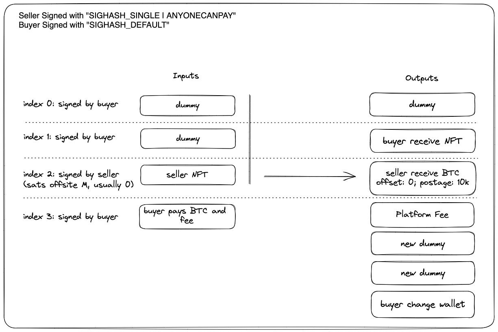

# msigner: Ordinals Atomic Swap PSBT Signer

msigner is an open source Bitcoin Ordinals Partially Signed Bitcoin Transactions (PSBT) signer library. It supports atomic swap of the inscription and provides a simple and secure way to structure Bitcoin transactions for marketplaces.

## Features

msigner library comes packed with a variety of features that make it an ideal choice for anyone looking for a simple and secure way to sign Bitcoin transactions. Here are some of the key features that set msigner apart:

- **2-Dummy UTXO algorithm (Latest Design)**: The library leverages a 2-Dummy UTXO algorithm that provides maximal protection to the offset of the ordinals. As a convention of the ecosystem, it provides an utxo of the NFT at location offset `0` with postage 10k sats. This algorithm ensures that the transactions are secure and that the NFT will not be accidentally included as other programs’ dummy UTXOs, or burn into miner fees.
- **Seller-Buyer-friendly API**:
    - Protecting Buyer: The buyer signer API ensures that buyers are protected by allowing them to sign the whole PSBT without needing to know the seller signatures. This means that the buyer can create a `sighash_all` transaction without revealing any information about the seller's signature, at the same time, the buyer can verify that the trackable sat is sending towards the correct location. As a result, the buyer can be confident that their interests are protected throughout the transaction process.
    - Protecting Seller: The seller signer API makes sure that the seller signature is not broadcasted, it is possible to change the price and cancel listings in a trust-minimized world. Since the marketplace platform can combine the seller’s `sighash_single|anyonecanpay` with the buyer’s `sighash_all` signatures, parties involved do not need to trust each other, rather they can rely on leveraging the wallets to **verify** the PSBT correctly.
- **Trust-minimized PSBT combining**: The library makes combining PSBT trust-minimized and requires 0 communication from the seller and buyer. This feature ensures that the transaction is secure and that the parties involved can trust each other without the need of further communication. The combined PSBT can be processed with mempool acceptance tests.
- **Wide range of wallets support**: msigner is targeting the browser-extension-type of wallets. `Hiro`, `Xverse`, `Unisats` are fully supported with P2SH, P2WPKH, P2TR inputs.
- Support maker/taker fees.
- Support dynamic bitcoin network fee with the selection of `fastestFee`, `halfHourFee`, `hourFee`, `minimumFee`.
- Support different address to receive NFTs and Fund for both the seller and the buyer signer.
- Support buyer and seller verification via fullnode’s mempool and the itemProvider.

## How it works

As a seller:
- Sign a single PSBT using the `SIGHASH_SINGLE | ANYONECANPAY`

As a buyer:
- Sign a full PSBT using the `SIGHASH_DEFAULT` with all the information available to the buyer, except the seller signature (i.e. finalScriptWitness).

As a platform combiner
- Verify seller signature
- Verify buyer signature
- Merge seller and buyer signatures
- Finalize and run mempool acceptance test
- Broadcast the tx

## Development

msigner is supposed to be used a dependency in any nodejs environment.
To develop msigner, simply clone the repository and follow these steps:

1. Install the required dependencies by running `npm install`.
2. Build the library by running `npm run build`.
3. Run the tests to ensure everything is working correctly by running `npm test`. More unit tests are coming!

## License
Apache 2.0
